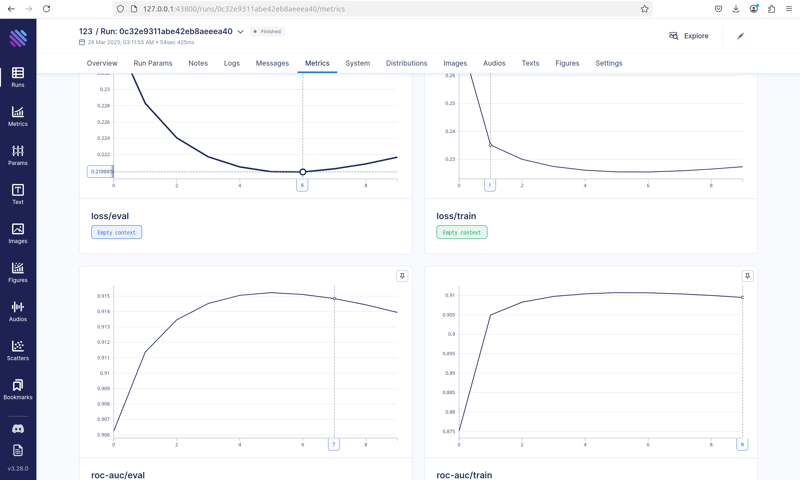
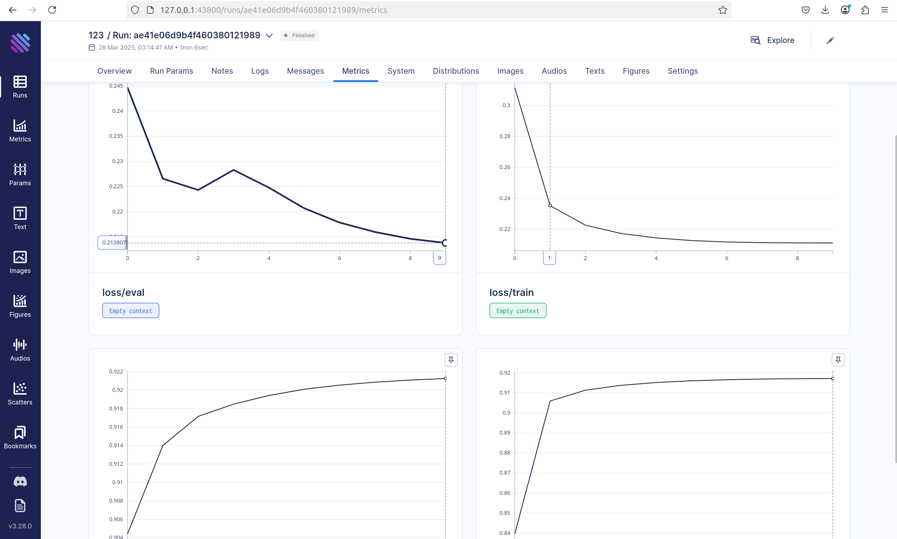
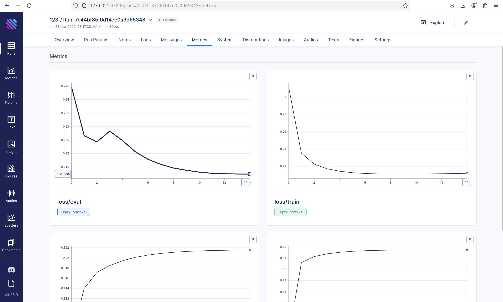
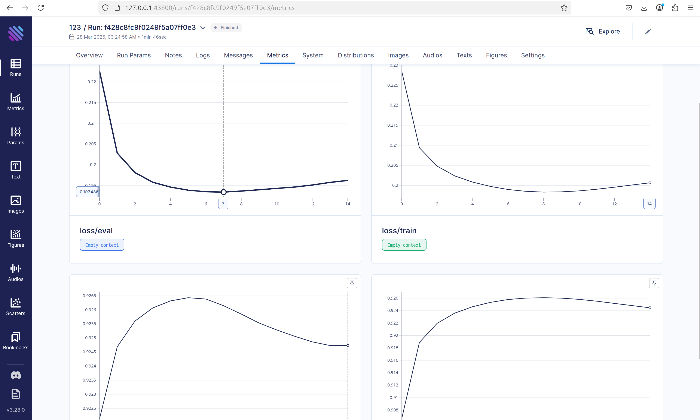

# Results of the experiments

## Experiment 1 (1 block, hidden_size=32)

### Видим отчётливый минимум на 6 эпохе, дальше которого loss на eval и train только растёт
### Видать, модель начинает переобучаться на этом моменте, хотя не то чтобы метрика вообще меняется дальше, но лучше не становится
### Аналогично выглядит метрика rocauc
### Вывод: оптимальное число эпох: 6

## Experiment 2 (3 blocks, hidden_size=128)

### Кажется, тут даже 10 эпох не хватило, попробую поставить 15

### Видать, просто модель перестала обучаться где-то на +- 10-ой эпохе
### Однако, результат всё равно лучше, чем в предыдущем эксперименте, rocauc стал выше на 0.07, что значит что модель стала лучше различать классы
### Запустил train несколько раз и каждый раз loss просто застывал в одной точке, видимо модель застряла в локальном минимуме

## Experiment 3 (experiment 2 with skip connections and batch norms)

### Результат стал чуток лучше, rocauc вырос примерно на 0.04, а лосс упал на 0.02. После эпохи 6-7 модель стала переобучаться
### Кажется, что rocauc скачет, но он меняется где-то на 0.0001 после достижения максимума, это связано просто со скейлом графика

## Experiment 4 (Dropout)

### Experiment 3