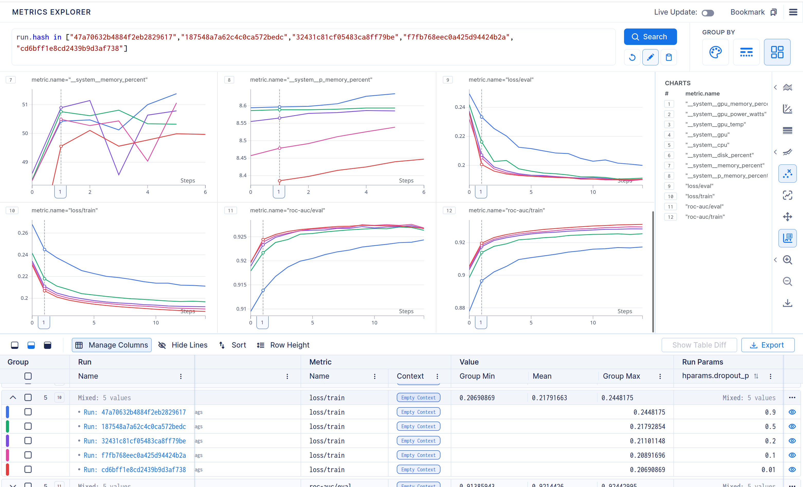
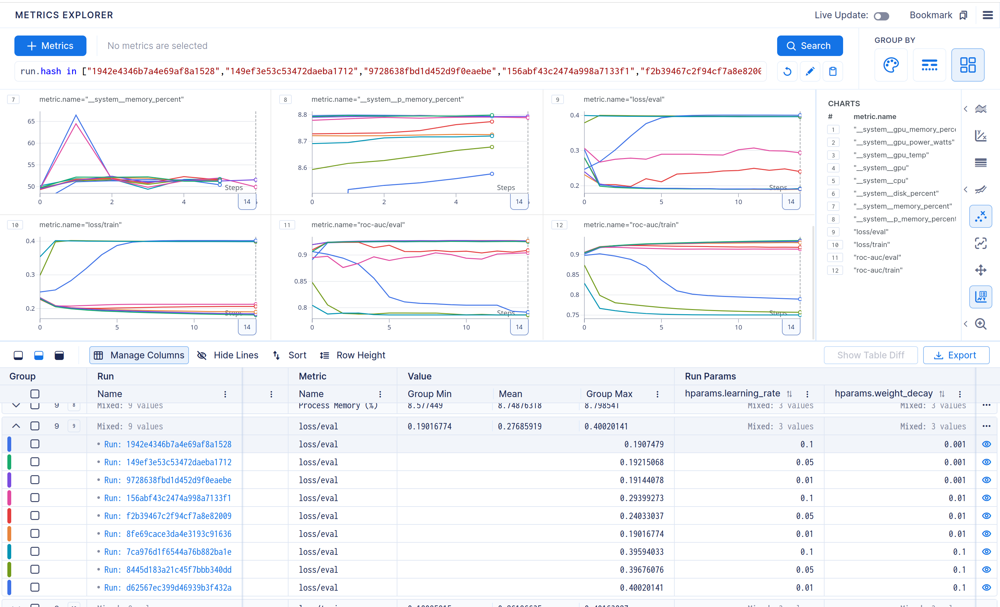
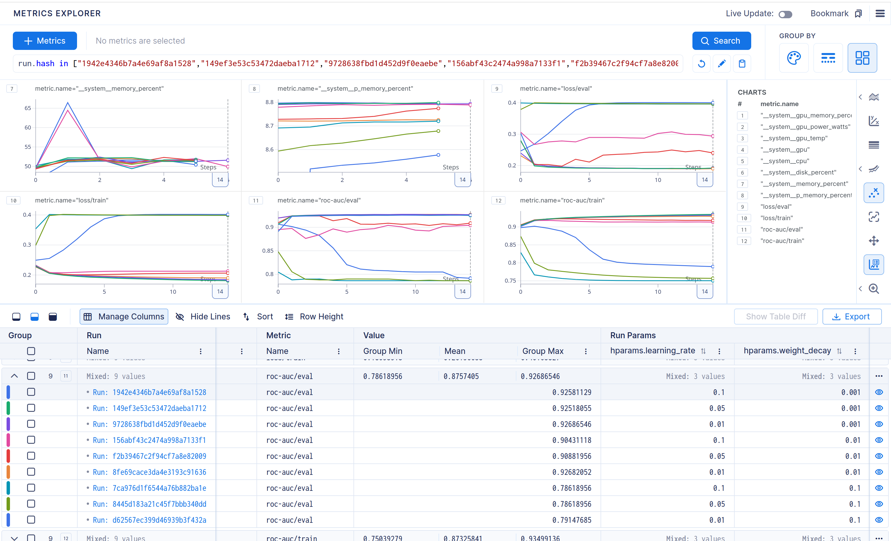

# Results of the experiments

## Experiment 1 (1 block, hidden_size=32)

### Видим отчётливый минимум на 6 эпохе, дальше которого loss на eval и train только растёт
### Видать, модель начинает переобучаться на этом моменте, хотя не то чтобы метрика вообще меняется дальше, но лучше не становится
### Аналогично выглядит метрика rocauc
### Вывод: оптимальное число эпох: 6

## Experiment 2 (3 blocks, hidden_size=128)

### Кажется, тут даже 10 эпох не хватило, попробую поставить 15

### Видать, просто модель перестала обучаться где-то на +- 10-ой эпохе
### Однако, результат всё равно лучше, чем в предыдущем эксперименте, rocauc стал выше на 0.07, что значит что модель стала лучше различать классы
### Запустил train несколько раз и каждый раз loss просто застывал в одной точке, видимо модель застряла в локальном минимуме

## Experiment 3 (experiment 2 with skip connections and batch norms)

### Результат стал чуток лучше, rocauc вырос примерно на 0.04, а лосс упал на 0.02. После эпохи 6-7 модель стала переобучаться
### Кажется, что rocauc скачет, но он меняется где-то на 0.0001 после достижения максимума, это связано просто со скейлом графика

## Experiment 4 (Dropout)

### Видно, что при увеличении dropout результаты становились хуже, однако 0.01 и 0.1 показывали примерно одни и те же результаты
### До добавления dropout модель не показывала сильные признаки переобучения, она скорее не обучалась вовсе дальше какого-то порога
### Можно сделать предположение, что задача требует более глубокой или более мощной модели и из-за этого сильная регуляризация только ухудшила резульаты

## Experiment 5 (Weight Decay, Learning Rate)
### Loss eval

### Rocauc eval

### Прослеживается одинаковая закономерность у обоих метрик: чем меньше weight_decay и чем меньше learning rate, тем лучше результат
### Однако при этом всём результат на weight decay = 0.01 и learning rate = 0.01 что на rocauc, что на loss даёт лучший результат
### Можно заметить, как на weight decay = 0.001 метрики дают примерно один и тот же результат и с увеличением лямбды начинают резко ухудшаться
### При этом внутри групп с одинаковым weight decay с уменьшением learning rate метрики улучшаются, но <u>совсем немного</u>, однако есть один выброс в виде результатов модели с параметрами (weight decay = 0.01, learning rate = 0.01), который даёт результат <u>значительно</u> лучше чем при бОльших значениях learning rate 
### Возможно, сказалось то, что итак используются batch norm и dropout слои + модель слишком маленькая, чтобы переобучиться, так что вероятно это не стабилизирует модель, а скорее мешает ей обучиться